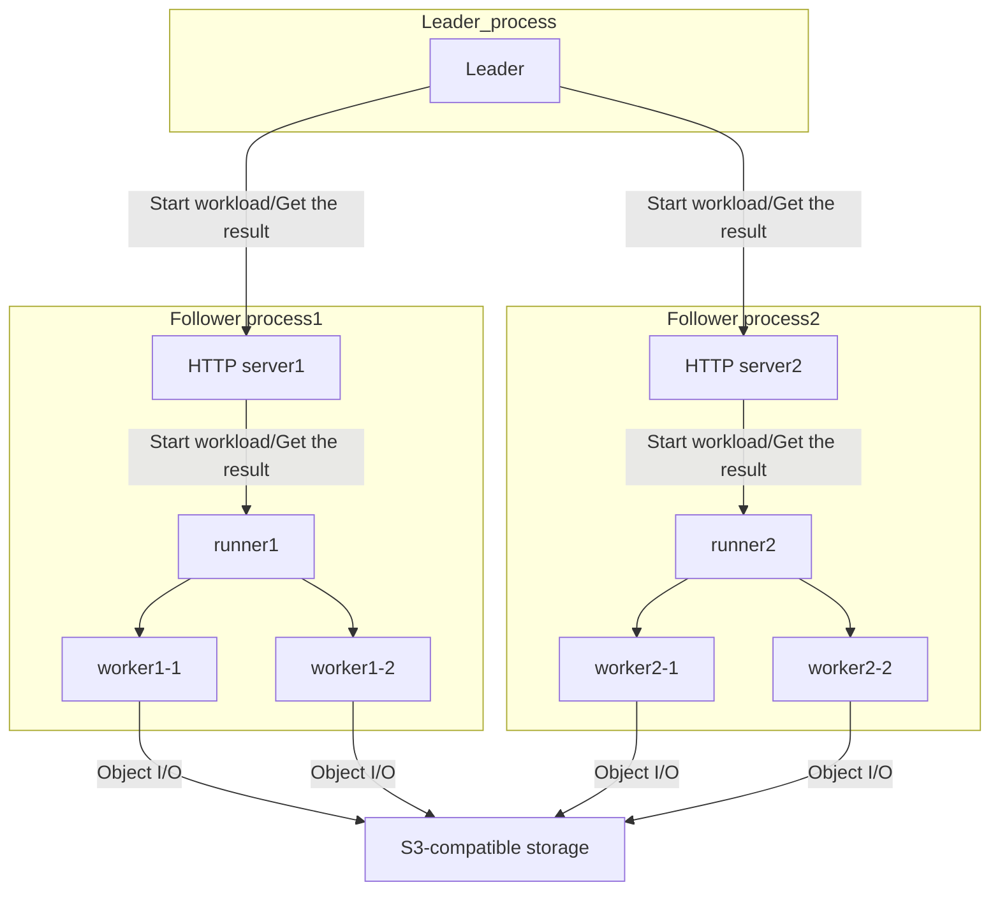

# Oval

## What is Oval?

Oval is a data validation tool for S3-compatible object storages.

## Motivation

Storage systems can hardly achieve 100% of data integrity. Data is usually damaged by two factors; failures and software bugs.
For failures, there are many techniques to reduce the impact, e.g. RAID, replication, erasure coding, backup. Though it is impossible to protect storage systems perfectly from data loss due to failures, the impact of failures can be controlled by paying the cost of data redundancy.

On the other hand, data corruption due to software bugs is unacceptable. It is hard to estimate the damage of data loss due to bugs because bugs can cause every bad thing.
For example, some bugs may destroy all redundant data copies. Unfortunately, no storage system is free from software bugs, but continuous efforts to reduce data corruption bugs are meaningful.

Some storage systems have internal defense mechanisms against data corruption, e.g. periodic CRC check, synchronous T10 DIF check.
However, these mechanisms can never be perfect solutions for two reasons. First, they have a theoretical limit on the ability to detect data corruption.
Secondly, these mechanisms themselves may also have bugs since they are also implemented by humans.

So, what should we do? One possible solution is to test storage systems in an end-to-end manner.
The simplest way to check data integrity is as follows.

1. Generate the random data.
2. Write the data which is generated in step 1.
3. Read the just-written data, and compare it with the original data which is generated in step 1.

However, this procedure is not enough;
There may be data-destroying bugs in the background data balancing process, or data may get corrupted by the concurrent data write, etc.
Generally speaking, those kinds of bugs are hard to detect.

To reveal the root cause of those bugs,
it is effective to do whatever operations to test storage systems while running I/O benchmark, and check the data integrity in the I/O benchmark tool.
For block storage, there are some brilliant tools for this purpose (cf. [vdbench](https://www.oracle.com/technetwork/server-storage/vdbench-1901683.pdf)),
but object storages seem to lack those data validation tools. That is why Oval was developed.

## How Oval works

Oval checks the data integrity during the object I/O benchmarks.
Oval stores the expected data contents for each object in memory,
and compares the actual data with it every time objects are read.

To detect the data corruption immediately, Oval issues get requests not only at random,
but also right before and after the put and delete operations.

Oval splits the data into several data units each of which has the size of 256 bytes,
and embeds the following information in the contents of the data unit itself:

- Bucket name
- Object's key name
- Write count (the generation of data)
- Offset of the data unit
- Worker ID
- Unix time
  - This is not used for data validation, but is helpful to investigate when the corrupted data was written.

If the read data include some unexpected content,
Oval dumps the actual binary data,
and you can investigate the root cause of the data corruption using the dump data.

## How to use

### The single-process mode

Just build and run Oval.

#### Example 1: Success case

```
$ ./oval --size 4k-16k --time 5s --num_obj 1024 --num_worker 4 --bucket "test-bucket,test-bucket2" --endpoint http://localhost:9000 --save test.json
2023/02/10 18:16:52 worker.go:33: Worker ID = 0x10a4, Key = [ov0000000000, ov00000000ff]
2023/02/10 18:16:52 worker.go:33: Worker ID = 0x10a5, Key = [ov0001000000, ov00010000ff]
2023/02/10 18:16:52 worker.go:33: Worker ID = 0x10a6, Key = [ov0002000000, ov00020000ff]
2023/02/10 18:16:52 worker.go:33: Worker ID = 0x10a7, Key = [ov0003000000, ov00030000ff]
2023/02/10 18:16:52 runner.go:151: Validation start.
2023/02/10 18:16:57 runner.go:193: Validation finished.
2023/02/10 18:16:57 stat.go:32: Statistics report.
2023/02/10 18:16:57 stat.go:33: put count: 651
2023/02/10 18:16:57 stat.go:34: get count: 554
2023/02/10 18:16:57 stat.go:35: get (for validation) count: 1237
2023/02/10 18:16:57 stat.go:36: delete count: 579
```

#### Example 2: Data corruption case

```
$ ./oval --size 4k-16k --time 5s --num_obj 1024 --num_worker 4 --bucket "test-bucket,test-bucket2" --endpoint http://localhost:9000 --save test.json
2023/02/10 18:23:21 worker.go:33: Worker ID = 0x8817, Key = [ov0000000000, ov00000000ff]
2023/02/10 18:23:21 worker.go:33: Worker ID = 0x8818, Key = [ov0001000000, ov00010000ff]
2023/02/10 18:23:21 worker.go:33: Worker ID = 0x8819, Key = [ov0002000000, ov00020000ff]
2023/02/10 18:23:21 worker.go:33: Worker ID = 0x881a, Key = [ov0003000000, ov00030000ff]
2023/02/10 18:23:21 runner.go:151: Validation start.
2023/02/10 18:23:22 worker.go:101: Data validation error occurred after put.
- WriteCount is wrong. (expected = "2", actual = "1")
- OffsetInObject is wrong. (expected = "0", actual = "256")
00000000  74 65 73 74 2d 62 75 63  6b 65 74 20 20 20 20 20  |test-bucket     |
          ^^^^^^^^^^^^^^^^^^^^^^^^^^^^^^^^^^^^^^^^^^^^^^^^ bucket name
00000010  6f 76 30 30 30 30 30 30  30 30 36 62 01 00 00 00  |ov000000006b....|
          ^^^^^^^^^^^^^^^^^^^^^^^^^^^^^^^^^^^^ key name
                                               ^^^^^^^^^^^ write count
00000020  00 01 00 00 17 88 00 00  02 59 7f 0c 55 f4 05 00  |.........Y..U...|
          ^^^^^^^^^^^ byte offset in this object
                      ^^^^^^^^^^^ worker ID
                                   ^^^^^^^^^^^^^^^^^^^^^^^ unix time (micro sec)
00000030  30 31 32 33 34 35 36 37  38 39 3a 3b 3c 3d 3e 3f  |0123456789:;<=>?|
00000040  40 41 42 43 44 45 46 47  48 49 4a 4b 4c 4d 4e 4f  |@ABCDEFGHIJKLMNO|
00000050  50 51 52 53 54 55 56 57  58 59 5a 5b 5c 5d 5e 5f  |PQRSTUVWXYZ[\]^_|
00000060  60 61 62 63 64 65 66 67  68 69 6a 6b 6c 6d 6e 6f  |`abcdefghijklmno|
00000070  70 71 72 73 74 75 76 77  78 79 7a 7b 7c 7d 7e 7f  |pqrstuvwxyz{|}~.|
00000080  80 81 82 83 84 85 86 87  88 89 8a 8b 8c 8d 8e 8f  |................|
00000090  90 91 92 93 94 95 96 97  98 99 9a 9b 9c 9d 9e 9f  |................|
000000a0  a0 a1 a2 a3 a4 a5 a6 a7  a8 a9 aa ab ac ad ae af  |................|
000000b0  b0 b1 b2 b3 b4 b5 b6 b7  b8 b9 ba bb bc bd be bf  |................|
000000c0  c0 c1 c2 c3 c4 c5 c6 c7  c8 c9 ca cb cc cd ce cf  |................|
000000d0  d0 d1 d2 d3 d4 d5 d6 d7  d8 d9 da db dc dd de df  |................|
000000e0  e0 e1 e2 e3 e4 e5 e6 e7  e8 e9 ea eb ec ed ee ef  |................|
000000f0  f0 f1 f2 f3 f4 f5 f6 f7  f8 f9 fa fb fc fd fe ff  |................|

2023/02/10 18:23:22 runner.go:193: Validation finished.
2023/02/10 18:23:22 stat.go:32: Statistics report.
2023/02/10 18:23:22 stat.go:33: put count: 128
2023/02/10 18:23:22 stat.go:34: get count: 89
2023/02/10 18:23:22 stat.go:35: get (for validation) count: 225
2023/02/10 18:23:22 stat.go:36: delete count: 97
2023/02/10 18:23:22 root.go:66: r.Run() failed.
```

### The multi-process mode

1. Start as many follower processes as you need.
2. Run the leader process.
3. Stop follower processes after you finish your tests.

#### Example: Success case

##### follower1

```
$ ./oval follower --follower_port 8080
2023/02/10 18:18:31 follower.go:41: Start server. port = 8080
2023/02/10 18:18:54 follower.go:46: Received a init request.
2023/02/10 18:18:54 follower.go:62: Received a start request.
2023/02/10 18:18:54 follower.go:119: ID: 0
2023/02/10 18:18:54 follower.go:120: Context: {http://localhost:9000 [test-bucket test-bucket2] 1024 4 4096 16384 0 []}
2023/02/10 18:18:54 follower.go:121: OpeRatio: [0.3333333333333333 0.3333333333333333 0.3333333333333333]
2023/02/10 18:18:54 follower.go:122: TimeInMs: 5000
2023/02/10 18:18:54 worker.go:33: Worker ID = 0x368a, Key = [ov0000000000, ov00000000ff]
2023/02/10 18:18:54 worker.go:33: Worker ID = 0x368b, Key = [ov0001000000, ov00010000ff]
2023/02/10 18:18:54 worker.go:33: Worker ID = 0x368c, Key = [ov0002000000, ov00020000ff]
2023/02/10 18:18:54 worker.go:33: Worker ID = 0x368d, Key = [ov0003000000, ov00030000ff]
2023/02/10 18:18:54 runner.go:151: Validation start.
2023/02/10 18:18:59 runner.go:193: Validation finished.
2023/02/10 18:18:59 stat.go:32: Statistics report.
2023/02/10 18:18:59 stat.go:33: put count: 471
2023/02/10 18:18:59 stat.go:34: get count: 436
2023/02/10 18:18:59 stat.go:35: get (for validation) count: 908
2023/02/10 18:18:59 stat.go:36: delete count: 434
```

##### follower2

```
$ ./oval follower --follower_port 8081
2023/02/10 18:18:41 follower.go:41: Start server. port = 8081
2023/02/10 18:18:54 follower.go:46: Received a init request.
2023/02/10 18:18:54 follower.go:62: Received a start request.
2023/02/10 18:18:54 follower.go:119: ID: 1
2023/02/10 18:18:54 follower.go:120: Context: {http://localhost:9000 [test-bucket test-bucket2] 1024 4 4096 16384 0 []}
2023/02/10 18:18:54 follower.go:121: OpeRatio: [0.3333333333333333 0.3333333333333333 0.3333333333333333]
2023/02/10 18:18:54 follower.go:122: TimeInMs: 5000
2023/02/10 18:18:54 worker.go:33: Worker ID = 0xb236, Key = [ov0100000000, ov01000000ff]
2023/02/10 18:18:54 worker.go:33: Worker ID = 0xb237, Key = [ov0101000000, ov01010000ff]
2023/02/10 18:18:54 worker.go:33: Worker ID = 0xb238, Key = [ov0102000000, ov01020000ff]
2023/02/10 18:18:54 worker.go:33: Worker ID = 0xb239, Key = [ov0103000000, ov01030000ff]
2023/02/10 18:18:54 runner.go:151: Validation start.
2023/02/10 18:18:59 runner.go:193: Validation finished.
2023/02/10 18:18:59 stat.go:32: Statistics report.
2023/02/10 18:18:59 stat.go:33: put count: 463
2023/02/10 18:18:59 stat.go:34: get count: 407
2023/02/10 18:18:59 stat.go:35: get (for validation) count: 896
2023/02/10 18:18:59 stat.go:36: delete count: 431
```

##### leader

```
$ ./oval leader --follower_list "http://localhost:8080,http://localhost:8081" --size 4k-16k --time 5s --num_obj 1024 --num_worker 4 --bucket "test-bucket,test-bucket2" --endpoint http://localhost:9000
2023/02/10 18:18:54 leader.go:31: Sent start requests to all followers.
2023/02/10 18:18:59 leader.go:37: The report from followers:
follower: http://localhost:8081
OK
follower: http://localhost:8080
OK
```

## Execution mode

Oval has two execution modes; the single-process mode and the multi-process mode. In the single-process mode, Oval runs as the single-process in a single node. That is the easiest way to use Oval.

However, in some test scenarios, a single process mode is insufficient. Bugs in storage systems are often revealed when some error happens in the storage system. One of the most common forms of error is timeout. When a timeout occurs for some internal process in the storage systems, it must be handled properly to clean things up. These error handling logics are error-prone.

Another common source of bugs is concurrency control. For example, processing many client requests may sometimes require a locking mechanism or other concurrent programming techniques. They have been producing many hard-to-find bugs for a long history.

One of the best ways to make these things happen artificially and find hidden bugs is to stress the storage system. The multi-process mode of Oval was developed for this purpose.

In the multi-process mode, follower processes run as web application servers first. Then, the leader process issues HTTP requests to all followers, and followers start their workload. The leader periodically checks whether each follower's job has finished. After all the work has been done, the leader collects the result and reports it to the user.

## Internals

The component diagram of the multi-process mode is as follows.



