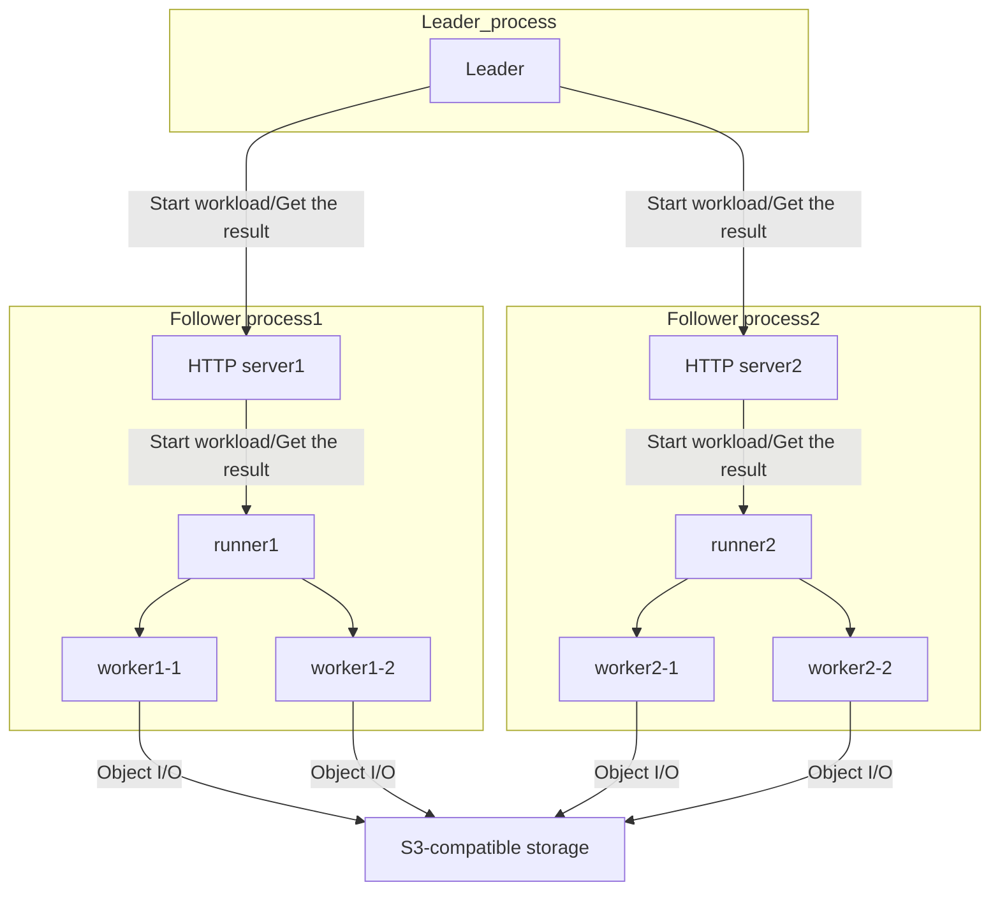

# Oval

## What is Oval?

Oval is a data validation tool for S3 compatible object storages.

## Motivation

Storage systems can hardly achieve 100% of data integrity. 
Though there is a lot of possible cause of data corruption, the data corruption due to software bugs is catastrophic. So continuous efforts to reduce the possibility of data corruption are required.   

Some storage systems have an internal defense mechanism against data corruption. However, it is sometimes useless when the data get corrupted in undetectable ways, or if there are bugs in the defense mechanism itself. In that case, data will get corrupted silently.

So, it is important for storage system's developers and users
to check if their storage systems have enough data integrity from the storage user's point of view.
People sometimes check data integrity by the following steps.

1. Generate the data to be written.
2. Write the data which is generated in step1.
3. Read the just-written data, and compare it with the original data which is generated in the step1.

However, this procedure is not enough;
There may be data destroying bugs in the background data rebalancing process, or data may get corrupted by the concurrent data write, etc.
Generally speaking, those kinds of bugs are hard to detect.

To reveal the root cause of those difficult data corruption bugs,
it is important to know when the data was destroyed and which process caused the problem.
For block storage, there are some brilliant tools (cf. [vdbench](https://www.oracle.com/technetwork/server-storage/vdbench-1901683.pdf)),
but object storages seem to lack those data validation tools. That is why Oval was developed.

## How Oval works

Oval checks the data integrity during the object I/O benchmarks.
Oval stores the expected data contents for each object in memory,
and compares the actual data with it every time an object is read.

To detect the data corruption as soon as possible, Oval issues get operations not only at random
but also right before and after the put and delete operations.

Oval splits the data into several data units each of which has the size of 256 bytes,
and embeds the following information in the contents of the data unit itself:

- Bucket name
- Object's key name
- Write count (the generation of data)
- Offset of the data unit
- Unix time
  - This is not used for data validation, but is helpful to investigate when the corrupted data was written.
- Worker ID

If the read data include some unexpected content,
Oval dumps the actual binary data,
and you can investigate the root cause of the data corruption using the dump data.

## How to use

```
$ make
$ ./oval -h
Usage of ./oval:
  -bucket string
        The name list of the buckets. e.g. "bucket1,bucket2"
  -endpoint string
        The endpoint URL and TCP port number. e.g. "http://127.0.0.1:9000"
  -follower
        The process run as a follower.
  -follower_list string
        [For leader] The follower list.
  -follower_port int
        [For follower] TCP port number to which a follower listens. (default -1)
  -leader
        The process run as the leader.
  -load string
        File name to load the execution context.
  -num_obj int
        The maximum number of objects. (default 10)
  -num_worker int
        The number of workers per process. (default 1)
  -ope_ratio string
        The ration of put, get and delete operations. e.g. "2,3,1" (default "1,1,1")
  -profiler
        Enable profiler.
  -save string
        File name to save the execution context.
  -size string
        The size of object. Should be in the form like "8k" or "4k-2m". The unit "g" or "G" is not allowed. (default "4k")
  -time int
        Time duration in seconds to run the workload. (default 3)
```

## Example

#### Success case (the single-process mode)

```
$ ./oval -size 4k-16k -time 5 -num_obj 1000 -num_worker 4 -bucket test-bucket -endpoint http://localhost:9000 
Worker ID = 0x5965, Key = [ov0000000000, ov0000000249]
Worker ID = 0x5966, Key = [ov0000000250, ov0000000499]
Worker ID = 0x5967, Key = [ov0000000500, ov0000000749]
Worker ID = 0x5968, Key = [ov0000000750, ov0000000999]
Validation start.
Validation finished.
Statistics report.
put count: 648
get count: 617
get (for validation) count: 1268
delete count: 584
```

#### Data corruption case (the single-process mode)

```
$ ./oval -size 4k-16k -time 5 -num_obj 1000 -num_worker 4 -bucket test-bucket -endpoint http://localhost:9000
Worker ID = 0xd33, Key = [ov0000000000, ov0000000249]
Worker ID = 0xd34, Key = [ov0000000250, ov0000000499]
Worker ID = 0xd35, Key = [ov0000000500, ov0000000749]
Worker ID = 0xd36, Key = [ov0000000750, ov0000000999]
Validation start.
worker.go:91: Data validation error occurred after put.
- WriteCount is wrong. (expected = "2", actual = "1")
- OffsetInObject is wrong. (expected = "0", actual = "256")
00000000  74 65 73 74 2d 62 75 63  6b 65 74 20 20 20 20 20  |test-bucket     |
          ^^^^^^^^^^^^^^^^^^^^^^^^^^^^^^^^^^^^^^^^^^^^^^^^ bucket name
00000010  6f 76 30 30 30 30 30 30  30 30 30 38 01 00 00 00  |ov0000000008....|
          ^^^^^^^^^^^^^^^^^^^^^^^^^^^^^^^^^^^^ key name
                                               ^^^^^^^^^^^ write count
00000020  00 01 00 00 33 0d 00 00  8f 12 45 e1 d7 ef 05 00  |....3.....E.....|
          ^^^^^^^^^^^ byte offset in this object
                      ^^^^^^^^^^^ worker ID
                                   ^^^^^^^^^^^^^^^^^^^^^^^ unix time (micro sec)
00000030  30 31 32 33 34 35 36 37  38 39 3a 3b 3c 3d 3e 3f  |0123456789:;<=>?|
00000040  40 41 42 43 44 45 46 47  48 49 4a 4b 4c 4d 4e 4f  |@ABCDEFGHIJKLMNO|
00000050  50 51 52 53 54 55 56 57  58 59 5a 5b 5c 5d 5e 5f  |PQRSTUVWXYZ[\]^_|
00000060  60 61 62 63 64 65 66 67  68 69 6a 6b 6c 6d 6e 6f  |`abcdefghijklmno|
00000070  70 71 72 73 74 75 76 77  78 79 7a 7b 7c 7d 7e 7f  |pqrstuvwxyz{|}~.|
00000080  80 81 82 83 84 85 86 87  88 89 8a 8b 8c 8d 8e 8f  |................|
00000090  90 91 92 93 94 95 96 97  98 99 9a 9b 9c 9d 9e 9f  |................|
000000a0  a0 a1 a2 a3 a4 a5 a6 a7  a8 a9 aa ab ac ad ae af  |................|
000000b0  b0 b1 b2 b3 b4 b5 b6 b7  b8 b9 ba bb bc bd be bf  |................|
000000c0  c0 c1 c2 c3 c4 c5 c6 c7  c8 c9 ca cb cc cd ce cf  |................|
000000d0  d0 d1 d2 d3 d4 d5 d6 d7  d8 d9 da db dc dd de df  |................|
000000e0  e0 e1 e2 e3 e4 e5 e6 e7  e8 e9 ea eb ec ed ee ef  |................|
000000f0  f0 f1 f2 f3 f4 f5 f6 f7  f8 f9 fa fb fc fd fe ff  |................|
```

#### Success case (the multi-process mode)

#### follower1

```
./oval --follower --follower_port 8080
follower.go:41: Start server. port = 8080
follower.go:46: Received a init request.
follower.go:62: Received a start request.
follower.go:119: ID: 0
follower.go:120: Context: {http://localhost:9000 [test-bucket] 1000 4 4096 16384 0 []}
follower.go:121: OpeRatio: [0.3333333333333333 0.3333333333333333 0.3333333333333333]
follower.go:122: TimeInMs: 5000
Worker ID = 0x8c23, Key = [ov0000000000, ov00000000f9]
Worker ID = 0x8c24, Key = [ov00000000fa, ov00000001f3]
Worker ID = 0x8c25, Key = [ov00000001f4, ov00000002ed]
Worker ID = 0x8c26, Key = [ov00000002ee, ov00000003e7]
Validation start.
Validation finished.
Statistics report.
put count: 453
get count: 436
get (for validation) count: 866
delete count: 395
```

#### follower2

```
./oval --follower --follower_port 8081
follower.go:41: Start server. port = 8081
follower.go:46: Received a init request.
follower.go:62: Received a start request.
follower.go:119: ID: 1
follower.go:120: Context: {http://localhost:9000 [test-bucket] 1000 4 4096 16384 0 []}
follower.go:121: OpeRatio: [0.3333333333333333 0.3333333333333333 0.3333333333333333]
follower.go:122: TimeInMs: 5000
Worker ID = 0x5c10, Key = [ov0100000000, ov01000000f9]
Worker ID = 0x5c11, Key = [ov01000000fa, ov01000001f3]
Worker ID = 0x5c12, Key = [ov01000001f4, ov01000002ed]
Worker ID = 0x5c13, Key = [ov01000002ee, ov01000003e7]
Validation start.
Validation finished.
Statistics report.
put count: 445
get count: 349
get (for validation) count: 869
delete count: 418
```

#### leader

```
$ ./oval -leader -follower_list http://localhost:8080,http://localhost:8081 -size 4k-16k -time 5 -num_obj 1000 -num_worker 4 -bucket test-bucket -endpoint http://localhost:9000
main.go:124: Sent start requests to all followers.
main.go:139: The report from followers:
follower: http://localhost:8081
OK
follower: http://localhost:8080
OK
```

## Execution mode

Oval has two execution modes; the single-process mode and the multi-process mode. In the single-process mode, Oval runs as the single-process in a single node. That is the easiest way to use Oval.

However, in some test scenarios, a single process mode is insufficient. Bugs in storage systems are often revealed when some error happens in the storage system. One of the most common forms of error is timeout. When a timeout occurs for some internal process in the storage systems, it must be handled properly to clean things up. These error handling logics are error-prone.

Another common source of bugs is concurrency control. For example, processing many client requests may sometimes require a locking mechanism or other concurrent programming techniques. They have been producing many hard-to-find bugs for a long history.

One of the best ways to make these things happen artificially and find hidden bugs is to stress the storage system. The multi-process mode of Oval was developed for this purpose.

The component diagram of the multi-process mode is as follows.



